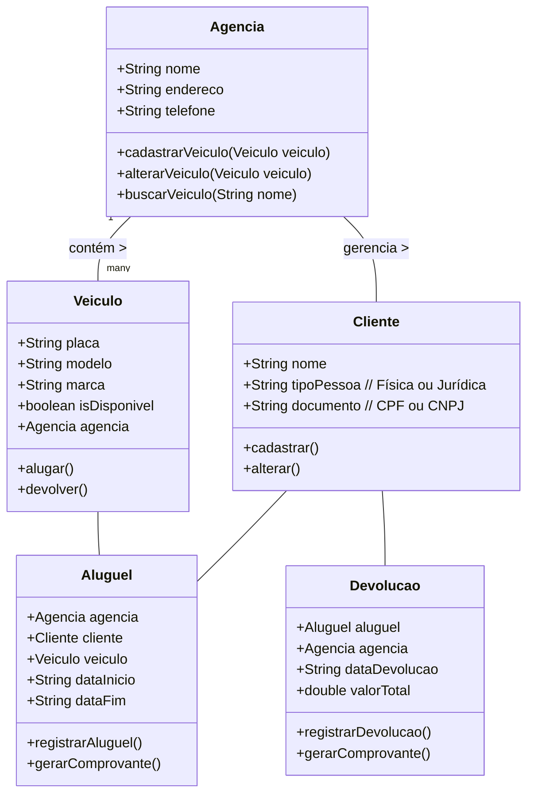

# Sistema de Aluguel de Veículos
Este projeto é um sistema de gerenciamento de aluguel de veículos que permite a locação e devolução de motos, carros e caminhões. O sistema garante que não haja veículos duplicados, gerencia a disponibilidade dos veículos e aplica regras de desconto conforme o tipo de cliente e o tempo de locação.

<p align="center">
     <a alt="Java" href="https://java.com" target="_blank">
        
    </a>
     <a alt="Maven" href="https://maven.apache.org/index.html" target="_blank">
        
    </a>
     <a alt="IntelliJ IDEA" href="https://www.jetbrains.com/idea/" target="_blank">
        
    </a>
</p>

## Visão Geral do Projeto

A aplicação lida com todo o processo de locação de veículos, incluindo:

- Cadastro e gerenciamento de veículos.
- Cadastro e gerenciamento de agências.
- Cadastro e gerenciamento de clientes (pessoa física e jurídica).
- Processos de aluguel e devolução de veículos.
- Regras de negócio, como aplicar descontos e evitar entradas duplicadas.

---

## Sumário

- [Funcionalidades](#funcionalidades)
- [Diagrama de Classes](#diagrama-de-classes)
- [Regras de Negócio](#regras-de-negócio)
- [Tabela de Preços](#tabela-de-preços)
- [Entregáveis](#entregáveis)
- [Funcionalidades a Implementar](#funcionalidades-a-implementar)
- [Acesso ao Projeto](#acesso-ao-projeto)
- [Autores](#autores)

---
## Funcionalidades

### Gerenciamento de Veículos:
- Cadastrar um novo veículo.
- Alterar um veículo existente.
- Buscar um veículo por parte do nome.
- Contem verificações para evitar duplicidade de dados.

### Gerenciamento de Agências:
- Cadastrar uma agência onde o veículo será alugado/devolvido.
- Alterar as informações da agência.
- Buscar uma agência pelo nome ou parte do endereço.
- Contem verificações para evitar duplicidade de dados.

### Gerenciamento de Clientes:
- Cadastrar clientes pessoa física (CPF).
- Cadastrar clientes pessoa jurídica (CNPJ).
- Alterar informações de clientes. 
- Contem verificações para evitar duplicidade de dados.

### Aluguel de Veículos:
- Alugar um veículo para pessoa física.
- Alugar um veículo para pessoa jurídica.

### Devolução de Veículos:
- Devolver um veículo para pessoa física.
- Devolver um veículo para pessoa jurídica.

### Comprovantes:
- Gerar um comprovante de aluguel com todos os dados relevantes (definido pelo grupo).
- Gerar um comprovante de devolução com todos os dados relevantes (definido pelo grupo).

---

## Diagrama de Classes



---
## Regras de Negócio

- **RN1:** Não é permitido cadastrar veículos duplicados.
- **RN2:** Tipos de veículos suportados: Carro, Moto, Caminhão.
- **RN3:** Aluguéis e devoluções devem registrar local, data e hora.
- **RN4:** Veículos alugados não podem ser marcados como disponíveis.
- **RN5:** Agências não podem ser duplicadas.
- **RN6:** Clientes não podem ser duplicados.
- **RN7:** Regras de devolução:
  - Pessoa física que alugar o veículo por mais de 5 dias terá um desconto de 5%.
  - Pessoa jurídica que alugar o veículo por mais de 3 dias terá um desconto de 10%.

---

## Tabela de Preços

O preço de aluguel diário para cada tipo de veículo é o seguinte:

| **Tipo de Veículo** | **Valor por Dia** |
|---------------------|-------------------|
| Moto                | R$ 100,00         |
| Carro               | R$ 150,00         |
| Caminhão            | R$ 200,00         |

---

## Entregáveis

- O projeto deve ser desenvolvido por um grupo.
- O projeto final deve ser entregue no GitHub.
- A documentação deve estar no arquivo `README.md`, incluindo diagramas das principais classes.
- Uma apresentação deve ser preparada para discutir os principais desafios, soluções e problemas enfrentados durante o projeto.
- Demonstrar onde os princípios SOLID foram aplicados e explicar onde não foram aplicados e por quê.

---

## Funcionalidades a Implementar

- Criar um sistema de entrada e saída de dados via terminal para simular o funcionamento da aplicação.
- **Paginação para as listas envolvidas:** veículos, clientes, agências.
- **Persistência dos dados:** em arquivos, memória ou base de 
  dados.

---
## Acesso ao projeto

Para acessar o projeto, siga estas instruções:

1.  Clone este repositório para o seu ambiente local usando o seguinte comando no terminal:
```bash    
    `git clone git@github.com:biancasanches-dev/locadora-veiculos-ada.git` 
```
2.  Abra o projeto na sua IDE de preferência.
    <br>
---

## Autores
<table>
  <tr>
    <td align="center">
      <a href="https://github.com/AlissonRafSilva">
        <br />
        <sub><b>Alisson Silva</b></sub>
      </a>
    </td>
    <td align="center">
      <a href="https://github.com/biancasanches-dev">
        <br />
        <sub><b>Bianca Sanches</b></sub>
      </a>
    </td>
    <td align="center">
      <a href="https://github.com/czagiacomo">
        <br />
        <sub><b>Catharina Zagiacomo</b></sub>
      </a>
    </td>
    <td align="center">
      <a href="https://github.com/Elisabete-MO">
        <br />
        <sub><b>Elisabete Oliveira</b></sub>
      </a>
    </td>
    <td align="center">
      <a href="https://github.com/iagooteles">
        <br />
        <sub><b>Iago Teles</b></sub>
      </a>
    </td>
    <td align="center">
      <a href="https://github.com/Nathalia-Asantos">
        <br />
        <sub><b>Nathalia Santos</b></sub>
      </a>
    </td>
  </tr>
</table>
